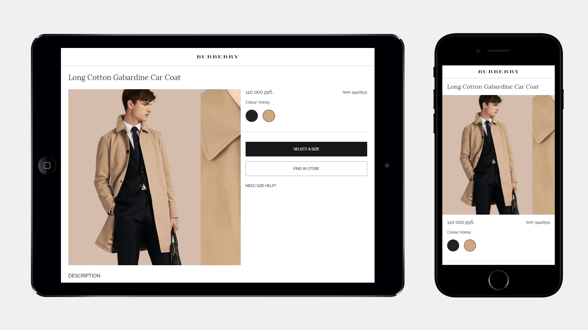

# Burberry Store Frontend
My homework project at [Evgeny Rodionov's](https://github.com/evgenyrodionov) [frontend course](https://kurskurskurs.erodionov.ru/).

Visual implementation is guided by layouts from the course materials that are based on official [Burberry website](https://burberry.com). Burberry® is a registered trademark of Burberry Limited.
# Screenshots

# Demo
[View project demo at RawGit](https://rawgit.com/mlshv/fake-burrberry-frontend/master/product.html)
